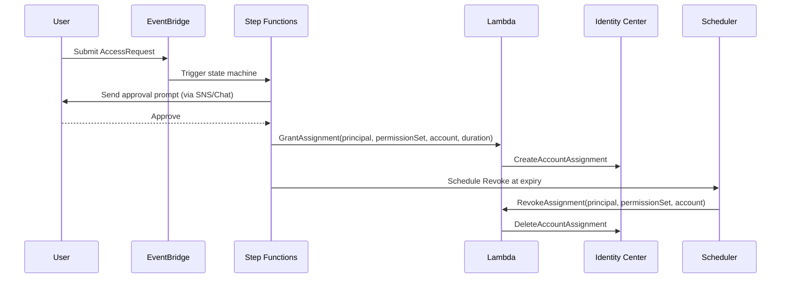

# ARCHITECTURE

## Components
- **AWS IAM Identity Center (SSO)** — Central auth; Permission Sets per role.
- **Lambda (assignment_manager)** — Creates & revokes account assignments.
- **Step Functions** — Orchestrates approval workflow with timeouts.
- **EventBridge (bus + scheduler)** — Event intake and scheduled revocation.
- **SNS / Chat** — Approval notifications to approvers.
- **CloudTrail, CloudWatch, Security Hub** — Audit & detection.

## Sequence (Mermaid)

## Guardrails
- **SCP** to restrict regions/services as needed.
- **Access Analyzer** for external access detection.
- **GuardDuty** for anomaly findings routed to Security Hub.